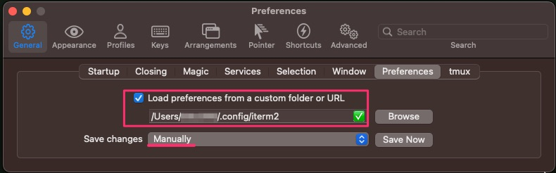
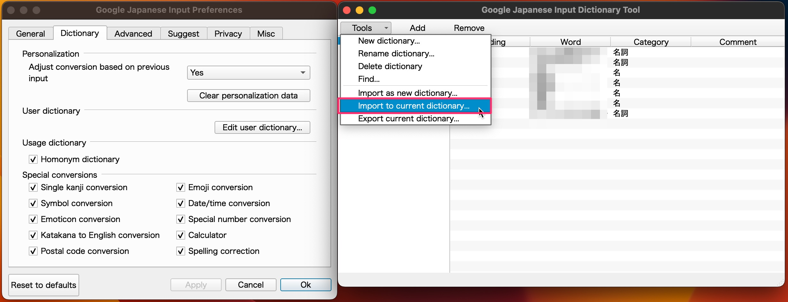

# toku345/dotfiles

toku345's dotfiles managed by chezmoi.

## Setup

1. Install [chezmoi](https://www.chezmoi.io/install/)
2. Initialize chezmoi

   ```sh
   chezmoi init --apply toku345
   ```

## Additional Setup

### iTerm2

Set the following value in iTerm2 preferences.

- General > Preferences > Load preferences from a custom folder or URL
  - `/User/<username>/.config/iterm2`



### Starship

A [Nerd Font](https://www.nerdfonts.com/) installed and enabled in your terminal.

- <https://starship.rs/guide/#prerequisites>

### Google Japanese Input

Import `~/.config/google_ime/google_ime_dictionary.txt`


