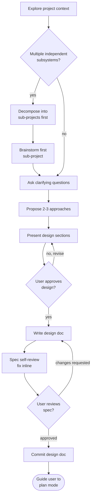

<!--
  Based on: obra/superpowers — Brainstorming Skill
  Original: https://github.com/obra/superpowers/blob/eafe962b18f6c5dc70fb7c8cc7e83e61f4cdde06/skills/brainstorming/SKILL.md

  MIT License
  Copyright (c) 2025 Jesse Vincent

  Permission is hereby granted, free of charge, to any person obtaining a copy
  of this software and associated documentation files (the "Software"), to deal
  in the Software without restriction, including without limitation the rights
  to use, copy, modify, merge, publish, distribute, sublicense, and/or sell
  copies of the Software, and to permit persons to whom the Software is
  furnished to do so, subject to the following conditions:

  The above copyright notice and this permission notice shall be included in all
  copies or substantial portions of the Software.

  THE SOFTWARE IS PROVIDED "AS IS", WITHOUT WARRANTY OF ANY KIND, EXPRESS OR
  IMPLIED, INCLUDING BUT NOT LIMITED TO THE WARRANTIES OF MERCHANTABILITY,
  FITNESS FOR A PARTICULAR PURPOSE AND NONINFRINGEMENT. IN NO EVENT SHALL THE
  AUTHORS OR COPYRIGHT HOLDERS BE LIABLE FOR ANY CLAIM, DAMAGES OR OTHER
  LIABILITY, WHETHER IN AN ACTION OF CONTRACT, TORT OR OTHERWISE, ARISING FROM,
  OUT OF OR IN CONNECTION WITH THE SOFTWARE OR THE USE OR OTHER DEALINGS IN THE
  SOFTWARE.

  Customizations from original:
  - Removed Visual Companion (browser-based tool) — using Mermaid code blocks instead
  - Removed writing-plans skill invocation — using Claude Code plan mode instead
  - Did not adopt git worktree automation from the broader superpowers ecosystem
  - Removed references to other superpowers skills (writing-plans, frontend-design, mcp-builder, elements-of-style)
  - Added explicit scope pre-assessment step
  - Changed design doc path to project-relative default (original: docs/superpowers/specs/)
  - Converted Process Flow from graphviz to Mermaid
  - Deferred git commit from write-time to after user approval (step 8), making it opt-in
  - Description in Japanese for trigger phrase matching
-->

# Brainstorming Ideas Into Designs

Help turn ideas into fully formed designs and specs through natural collaborative dialogue.

Start by understanding the current project context, then ask questions one at a time to refine the idea. Once you understand what you're building, present the design and get user approval.

<HARD-GATE>
Do NOT invoke any implementation skill, write any code, scaffold any project, or take any implementation action until you have presented a design and the user has approved it. This applies to EVERY project regardless of perceived simplicity.
</HARD-GATE>

## Anti-Pattern: "This Is Too Simple To Need A Design"

Every project goes through this process. A todo list, a single-function utility, a config change — all of them. "Simple" projects are where unexamined assumptions cause the most wasted work. The design can be short (a few sentences for truly simple projects), but you MUST present it and get approval.

## Checklist

You MUST create a task for each of these items and complete them in order:

1. **Explore project context and assess scope** — check files, docs, recent commits. Evaluate whether the request contains multiple independent subsystems that should be decomposed first.
2. **Ask clarifying questions** — one at a time, understand purpose/constraints/success criteria
3. **Propose 2-3 approaches** — with trade-offs and your recommendation
4. **Present design** — in sections scaled to their complexity, get user approval after each section. Use Mermaid diagrams where they aid understanding.
5. **Write design doc** — save to `YYYY-MM-DD-<topic>-design.md` (default: `docs/plans/`; adapt to the project's conventions)
6. **Spec self-review** — quick inline check for placeholders, contradictions, ambiguity, scope (see below)
7. **User reviews written spec** — ask user to review the spec file before proceeding
8. **Commit design doc** — after user approval, commit the spec to git (opt-in: skip if the user prefers not to commit)

## Process Flow



## The Process

**Understanding the idea:**

- Check out the current project state first (files, docs, recent commits)
- Before asking detailed questions, assess scope: if the request describes multiple independent subsystems (e.g., "build a platform with chat, file storage, billing, and analytics"), flag this immediately. Don't spend questions refining details of a project that needs to be decomposed first.
- If the project is too large for a single spec, help the user decompose into sub-projects: what are the independent pieces, how do they relate, what order should they be built? Then brainstorm the first sub-project through the normal design flow. Each sub-project gets its own spec → plan → implementation cycle.
- For appropriately-scoped projects, ask questions one at a time to refine the idea
- Prefer multiple-choice questions when possible, but open-ended is fine too
- Only one question per message — if a topic needs more exploration, break it into multiple questions
- Focus on understanding: purpose, constraints, success criteria

**Exploring approaches:**

- Propose 2-3 different approaches with trade-offs
- Present options conversationally with your recommendation and reasoning
- Lead with your recommended option and explain why

**Presenting the design:**

- Once you believe you understand what you're building, present the design
- Scale each section to its complexity: a few sentences if straightforward, up to 200-300 words if nuanced
- Ask after each section whether it looks right so far
- Cover: architecture, components, data flow, error handling, testing
- Be ready to go back and clarify if something doesn't make sense
- **Use Mermaid diagrams** to illustrate architecture, state transitions, sequence flows, or data flows wherever they aid understanding. Embed them as fenced code blocks (` ```mermaid `).

**Design for isolation and clarity:**

- Break the system into smaller units that each have one clear purpose, communicate through well-defined interfaces, and can be understood and tested independently
- For each unit, you should be able to answer: what does it do, how do you use it, and what does it depend on?
- Can someone understand what a unit does without reading its internals? Can you change the internals without breaking consumers? If not, the boundaries need work.
- Smaller, well-bounded units are also easier for you to work with — you reason better about code you can hold in context at once, and your edits are more reliable when files are focused. When a file grows large, that's often a signal that it's doing too much.

**Working in existing codebases:**

- Explore the current structure before proposing changes. Follow existing patterns.
- Where existing code has problems that affect the work (e.g., a file that's grown too large, unclear boundaries, tangled responsibilities), include targeted improvements as part of the design — the way a good developer improves code they're working in.
- Don't propose unrelated refactoring. Stay focused on what serves the current goal.

## After the Design

**Documentation:**

- Write the validated design (spec) to `YYYY-MM-DD-<topic>-design.md` (default: `docs/plans/`; adapt to the project's conventions)
  - User preferences for spec location override this default
- Do NOT commit yet — wait for user approval (see User Review Gate below)

**Spec Self-Review:**
After writing the spec document, look at it with fresh eyes:

1. **Placeholder scan:** Any "TBD", "TODO", incomplete sections, or vague requirements? Fix them.
2. **Internal consistency:** Do any sections contradict each other? Does the architecture match the feature descriptions?
3. **Scope check:** Is this focused enough for a single implementation plan, or does it need decomposition?
4. **Ambiguity check:** Could any requirement be interpreted two different ways? If so, pick one and make it explicit.

Fix any issues inline. No need to re-review — just fix and move on.

**User Review Gate:**
After the spec review loop passes, ask the user to review the written spec before proceeding:

> "Spec written to `<path>`. Please review it and let me know if you want to make any changes before we move to implementation planning."

Wait for the user's response. If they request changes, make them and re-run the spec review loop. Only proceed once the user approves.

**Commit after approval:**
Once the user approves the spec, commit the design document to git. If the user prefers not to commit, skip this step.

**Transition to implementation planning:**

After the user approves the spec, guide them to implementation planning. Adapt the message to the current context:

> If already in plan mode: "Design approved. The spec is at `<path>`. You can continue in this session to create the implementation plan."
>
> If not in plan mode: "Design approved. To create an implementation plan, switch to plan mode (Shift+Tab) and reference the design doc at `<path>`."

Do NOT write code, scaffold projects, or take any implementation action. The brainstorming skill's responsibility ends when the spec is approved and the user is guided to implementation planning.

## Key Principles

- **One question at a time** — Don't overwhelm with multiple questions
- **Multiple choice preferred** — Easier to answer than open-ended when possible
- **YAGNI ruthlessly** — Remove unnecessary features from all designs
- **Explore alternatives** — Always propose 2-3 approaches before settling
- **Incremental validation** — Present design, get approval before moving on
- **Be flexible** — Go back and clarify when something doesn't make sense
- **Visualize with Mermaid** — Use diagrams for architecture, state machines, sequences, and data flows
